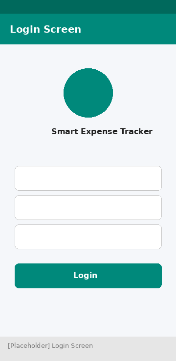
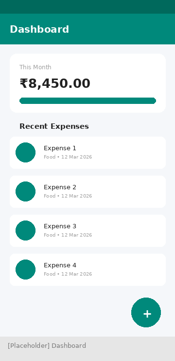
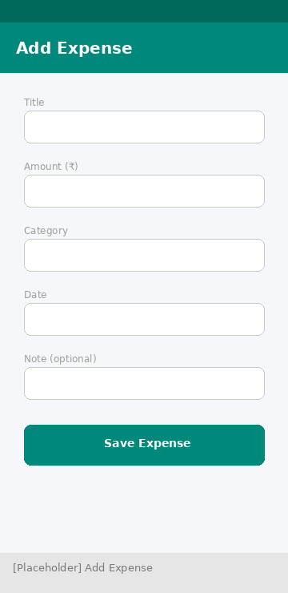
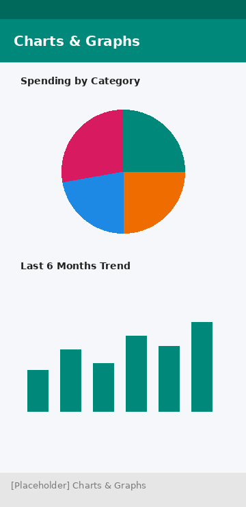
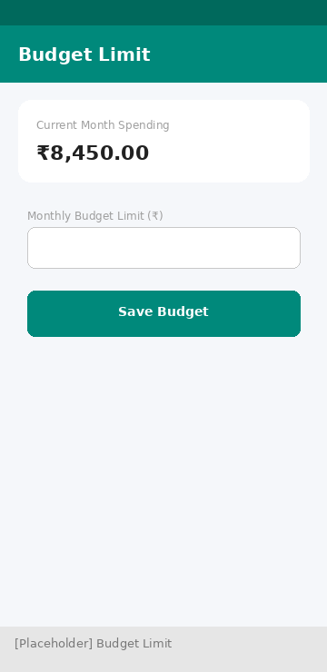
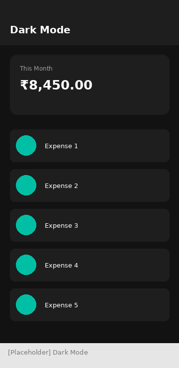

<div align="center">

# 💰 Smart Expense Tracker

### A Flutter-based mobile application to track, analyze, and manage personal expenses smartly.

[](https://flutter.dev)
[](https://dart.dev)
[](LICENSE)
[](#)
[](#)
[](CONTRIBUTING.md)
[](.github/workflows/flutter_ci.yml)

A Mobile Application Development internship project built by a 4-member student team.

</div>

---

## 📖 Project Description

**Smart Expense Tracker** is a cross-platform mobile application built with Flutter that helps users record, categorize, and analyze their daily expenses. It was developed as a team internship project to solve a real, everyday problem: most people lose track of their spending simply because logging expenses is inconvenient. This app makes it fast, visual, and genuinely useful to track where your money goes — entirely offline, with no account sign-up required.

The app supports adding and editing expenses, visualizing spending with charts, setting a monthly budget with alert notifications, and exporting reports as PDF or CSV — all wrapped in a clean, responsive UI with full Dark Mode support.

---

## 🎯 Objectives

- Build a fully functional, offline-capable expense tracking mobile app.
- Apply core mobile development concepts: state management, local persistence, and responsive UI design.
- Provide meaningful data visualization so users understand their spending habits.
- Implement a real-world feature set (budgeting, notifications, export) within an academic timeline.
- Practice collaborative software development using Git/GitHub with clearly divided responsibilities.

---

## ✨ Features

| Feature | Description |
|---------|-------------|
| 🔐 User Login (Demo) | Simulated local login flow for demo purposes |
| 📊 Dashboard | At-a-glance monthly spending summary and recent expenses |
| ➕ Add / Edit / Delete Expenses | Full CRUD support with form validation |
| 🏷️ Expense Categories | 8 predefined categories with icons and colors |
| 📅 Monthly Expense Summary | Browse totals and breakdowns month by month |
| 🔍 Search & Filter | Search by title, filter by category instantly |
| 📈 Charts/Graphs | Category-wise pie chart and 6-month spending trend bar chart |
| 🔔 Budget Limit Notification | Local alert when spending nears/exceeds your set budget |
| 📤 Export Report (PDF/CSV) | Generate and share downloadable expense reports |
| 🌙 Dark Mode | Full light/dark theme support, persisted across sessions |
| 📱 Responsive UI | Clean Material 3-inspired design that adapts to different screen sizes |

---

## 🛠️ Technology Stack

| Layer | Technology |
|-------|-----------|
| **Framework** | Flutter (Dart) |
| **State Management** | Provider |
| **Local Database** | SQLite (`sqflite`) |
| **Local Storage** | SharedPreferences |
| **Charts** | fl_chart |
| **Notifications** | flutter_local_notifications |
| **PDF/CSV Export** | pdf, csv, share_plus |
| **Version Control** | Git & GitHub |
| **CI** | GitHub Actions |

---

## 🏗️ System Architecture

The app follows a clean, layered architecture to separate UI from business logic and data persistence:

```
┌─────────────────────────────┐
│         UI Layer            │   screens/, widgets/
├─────────────────────────────┤
│  State Management Layer     │   providers/ (ExpenseProvider, ThemeProvider)
├─────────────────────────────┤
│      Service Layer          │   services/ (DBHelper, AuthService,
│                              │   NotificationService, ExportService)
├─────────────────────────────┤
│        Data Layer           │   SQLite + SharedPreferences
└─────────────────────────────┘
```

See [`docs/ARCHITECTURE.md`](docs/ARCHITECTURE.md) for a detailed breakdown and data-flow example.

---

## 📁 Folder Structure

```
smart-expense-tracker/
├── android/                  # Android platform config notes
├── ios/                       # iOS platform config notes
├── assets/
│   ├── images/                 # Illustrations, empty-state graphics
│   └── icons/                  # App icon
├── docs/
│   ├── PROJECT_REPORT.md       # Full internship project report
│   ├── ARCHITECTURE.md         # Detailed architecture documentation
│   └── REFERENCES.md           # Resources & documentation references
├── lib/
│   ├── main.dart                # App entry point
│   ├── models/                  # Data models (Expense, Budget, User)
│   ├── providers/                # State management (Provider package)
│   ├── screens/                  # Full-page UI screens
│   ├── widgets/                   # Reusable UI components
│   ├── services/                   # DB, Auth, Notification, Export logic
│   └── utils/                       # Constants, formatters, validators
├── test/                      # Unit tests
├── screenshots/              # App screenshots (placeholders)
├── .github/                  # Issue templates, PR template, CI workflow
├── pubspec.yaml               # Dependencies
├── analysis_options.yaml      # Lint rules
├── .gitignore
├── LICENSE
├── CONTRIBUTING.md
└── CHANGELOG.md
```

---

## ⚙️ Installation Steps

### Prerequisites
- [Flutter SDK](https://docs.flutter.dev/get-started/install) (3.22.0 or higher)
- Android Studio or VS Code with the Flutter/Dart plugins
- An Android emulator, iOS simulator, or physical device

### Steps

1. **Clone the repository**
   ```bash
   git clone https://github.com/<your-username>/smart-expense-tracker.git
   cd smart-expense-tracker
   ```

2. **Install dependencies**
   ```bash
   flutter pub get
   ```

3. **Run the platform scaffolding** (generates `android/` and `ios/` native project files)
   ```bash
   flutter create .
   ```

4. **Run the app**
   ```bash
   flutter run
   ```

5. **(Optional) Run tests**
   ```bash
   flutter test
   ```

---

## 📱 Usage Guide

1. **Login** — Enter any name, a valid email format, and a password (4+ characters) on the demo login screen.
2. **Dashboard** — View your current month's total spending and recent transactions.
3. **Add an Expense** — Tap the **+** button, fill in the title, amount, category, and date, then save.
4. **Edit/Delete** — Tap any expense to edit it, or swipe left to delete.
5. **Search & Filter** — Use the search bar or category chips to quickly find specific expenses.
6. **Monthly Summary** — Navigate between months to see historical totals.
7. **Charts** — View your spending distribution and 6-month trend visually.
8. **Set a Budget** — Open the drawer → Budget Limit, enter your monthly limit, and save. You'll be notified if you exceed it.
9. **Export a Report** — Open the drawer → Export Report, choose CSV or PDF, and share it via any installed app.
10. **Dark Mode** — Toggle dark mode from the navigation drawer; your preference is remembered.

---

## 📸 Screenshots

> Screenshots below are layout placeholders. Replace with actual device captures before final submission.

| Login | Dashboard | Add Expense |
|-------|-----------|--------------|
|  |  |  |

| Charts | Budget Limit | Dark Mode |
|--------|---------------|-----------|
|  |  |  |

See [`screenshots/README.md`](screenshots/README.md) for the full list.

---

## 🚀 Future Enhancements

- ☁️ Cloud sync and backup (Firebase/REST API) for multi-device access
- 🔁 Recurring expense reminders (subscriptions, EMIs)
- 💱 Multi-currency support
- 🔒 Biometric login (fingerprint/Face ID)
- 👥 Group expense sharing and splitting
- 🎙️ Voice-based expense entry

---

## 👥 Team Members & Contributions

| Name | Responsibility |
|------|------------------|
| **Nandhini K** | UI/UX Design and Frontend Development |
| **Muthamil P** | Backend Logic and Database Integration |
| **Monisha S** | Testing, Documentation, and Bug Fixing |
| **Arbiya K** | Project Management, GitHub Repository Maintenance, and Final Integration |

For a detailed breakdown of individual contributions, see [`docs/PROJECT_REPORT.md`](docs/PROJECT_REPORT.md#10-individual-contributions-detailed).

---

## 📄 License

This project is licensed under the [MIT License](LICENSE) — see the LICENSE file for details.

---

## 📚 References

See [`docs/REFERENCES.md`](docs/REFERENCES.md) for the full list of documentation and resources used while building this project.

---

<div align="center">

Built with 💚 by Team Smart Expense Tracker — Nandhini K · Muthamil P · Monisha S · Arbiya K

</div>
